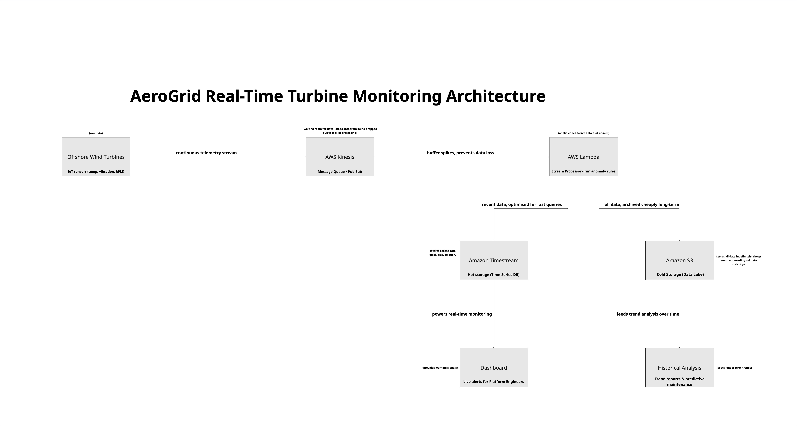

# AeroGrid Turbine Anomaly Detection & Monitoring Architecture

## Overview

AeroGrid is a renewable energy provider managing a fleet of offshore wind
turbines fitted with IoT sensors. Their legacy server was struggling to
ingest the constant stream of telemetry data, and engineers were missing
early warning signs of turbine failure buried in the logs.

This repository is the Engineering Solutions Package addressing that
problem, containing four parts: a Python script that detects failing
turbines from sensor data, a Dockerfile to containerise it, a proposed
cloud architecture to replace the single-server setup, and a written
engineering report.

## Repository Contents

- `turbine_anomaly_detection.py` — anomaly detection script
- `requirements.txt` — Python dependencies
- `Dockerfile` — containerises the script
- `.dockerignore` — excludes unnecessary files from the Docker build
- `telemetry_data.xlsx` — sample 24-hour telemetry data
- `architecture-diagram.jpg` — proposed real-time cloud architecture
- `engineering_report.md` — findings, architecture justification, and cost optimisation strategy

## Findings

Two turbines require urgent maintenance:

- **T-04** — average temperature of 90.58°C, exceeding the 85°C safety threshold
- **T-07** — peak vibration of 25.0mm/s, exceeding the 15mm/s safety threshold

All other turbines in the sample are operating within normal limits.

## Running the Script Locally

```bash
pip3 install -r requirements.txt
python3 turbine_anomaly_detection.py telemetry_data.xlsx
```

## Running with Docker

```bash
docker build -t turbine-anomaly-detector .
docker run --rm -v "$(pwd)/telemetry_data.xlsx:/app/telemetry_data.xlsx" turbine-anomaly-detector telemetry_data.xlsx
```

## Proposed Cloud Architecture



Telemetry flows from the turbines into a message queue (AWS Kinesis),
which buffers spikes so no data is lost. A stream processor (AWS Lambda)
then applies the anomaly rules in real time. Results split into hot
storage (Amazon Timestream) for live dashboards, and cold storage
(Amazon S3) for cheap long-term archiving and trend analysis.

## Engineering Report

See [`engineering_report.md`](./engineering_report.md) for the full
write-up covering findings, architecture justification, and a cost
optimisation strategy.